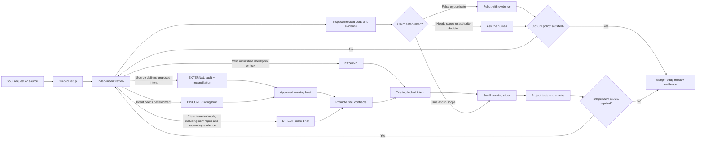

# Ultimate Agent Stack

[](https://www.npmjs.com/package/ultimate-agent-stack)
[](https://github.com/samtay32/ultimate-agent-stack/actions/workflows/ci.yml)
[](LICENSE)
[](package.json)

**Your Project Steward — one conversation managing the entire build.**

Ultimate Agent Stack gives a coding agent a clear path from your idea to a
tested, reviewed result. It installs project rules, reusable skills, safety
checks, and durable progress files through one npm package.

You describe the outcome. The agent handles setup, planning, coding, tests,
documentation, and review. You keep control of credentials, spending, legal
choices, destructive production actions, merging, and publishing.

> **Honest boundary:** this package can enforce the rules owned by its CLI. It
> cannot force every coding agent to follow written instructions, and it is not
> an operating-system sandbox. See [What Is Actually Enforced](docs/TRUST.md).

Provider-neutral does not mean every model/harness combination is silently
declared compatible. The same project contract and skills are installed for
each supported adapter. When behavior changes, live evidence is attached to the
exact-head pull request or release record and names the exact harness and model,
as described in [the release guide](docs/RELEASE.md). A harness that cannot
follow the shared contract safely is reported as limited or untested; the
package does not add vendor-specific exceptions or weaken the contract to
manufacture a pass.

## Start in 30 Seconds

Open or create a dedicated project folder in Codex, Claude Code, Cursor,
Gemini, Grok, OpenCode, or another capable coding agent. Paste:

```text
Set up Ultimate Agent Stack in this project. My idea is: [describe the result].
If this is a simple project, recommend the simple setup. For every decision I
actually need to make, recommend one safe choice and handle the technical work.
```

The agent installs the stack, checks the project, recommends safe defaults, and
asks one important question at a time. You can answer:

```text
Use the recommendation.
```

The agent first recognizes what you supplied:

- a vague product or system idea becomes a collaborative working brief;
- substantial material that defines product intent or an existing plan is
  audited instead of re-interviewed from scratch;
- a clear bounded request goes straight to proportionate shaping;
- a valid non-complete checkpoint or locked contract with an unmet done or
  evidence condition resumes from the first unfinished condition.

A supporting screenshot, log, or attachment does not turn a clear bounded
request into a full source audit. Clear bounded work remains DIRECT in a new or
empty repository, while completed state does not hijack a new request.

It then promotes approved intent, builds in small working pieces, runs the
project's real checks, prepares a pull request, and closes valid review
findings. You may also ask it to stop after an approved brief.

No coding knowledge is required for this path. The
[plain-language operating manual](docs/OPERATING_MANUAL.md) explains what to
expect.

## Three Commands

Coders and maintainers can run the CLI directly:

```bash
# Add the stack to the current project
npx -y ultimate-agent-stack@latest init --concise

# See whether setup and safety checks are ready
node .agent-stack/bin/agent-stack.mjs doctor --human

# Update safely later
npx -y ultimate-agent-stack@latest upgrade --concise
```

The CLI is non-interactive. The coding agent runs the guided conversation and
records the choices you approve. Existing files are preserved when they differ;
updates create proposals for review instead of overwriting them.
The setup examples use `--concise` so an agent sees a small result that still
lists every path needing reconciliation or another manual decision, plus
notable preserved local paths. Counts summarize ordinary outcomes. The CLI
returns the complete per-file JSON result by default for scripts and maintainers
that need every outcome.

## Mechanical Activation and Review Receipts

Activation and readiness are derived from stack-generated receipts, not from
skill names or approval prose in a model response:

```bash
node .agent-stack/bin/agent-stack.mjs evidence activation-status \
  --run RUN --require SKILL
node .agent-stack/bin/agent-stack.mjs review status --run RUN
node .agent-stack/bin/agent-stack.mjs status --run RUN
```

The coordinator can record a local pre-PR result only with a clean exact Git
head and a structured JSON reviewer artifact such as
`.agent-stack/runs/reviews/<safe-id>.json`. The artifact is bounded and must
contain `schema_version`, the exact `run_id` and `git_commit`, reviewer kind and
identity, `result`, a summary, bounded findings, and `reviewed_at`. A reviewer
identity must be nonempty and distinct from the coordinator; reviewer kind and
identity need not be different strings. Missing, failed, unavailable, altered,
stale, dirty, empty, wrong-run, wrong-commit, malformed, or evidence with the
same recorded reviewer and coordinator identity keeps the review gate blocked.
Local receipts are separate from protected
GitHub review receipts, and claim only `agent-recorded`; they do not
authenticate a harness or external provider. Receipt and verification-check
hashes detect content alteration but cannot authenticate a provider, agent, or
editor. `review unavailable` is a durable
blocker, never a successful review claim.
The distinct-physical-agent boundary remains agent-recorded and
non-authenticated.

`review status --run RUN` preserves the local structural result but keeps
`independent_reviewed` and `review_gate_ready` false: agent-recorded receipts
cannot prove distinct reviewer delegation. In a profile that requires external
review, `status --run RUN` remains blocked until the protected GitHub receipt
satisfies that separate authenticated gate. The default builtin policy does not
require an external review, but still requires a valid passed exact-head local
audit plus successful project and verification gates. It may then be ready
while `independent_reviewed` remains false; this is policy satisfaction, not
authenticated independence.

The ordinary `verify` command may run configured checks on a dirty
worktree; `status --run RUN` still requires a clean exact-head verification.
Verification records the checkout real path so evidence cannot be replayed in
another checkout. This does not authenticate the writer or prevent same-path
recomputation.

For deterministic live evaluation, keep the request plus serialized context at
or below 2 KiB (target roughly 512 input tokens), with no repository dumps or
expected skill names. This is a portable prompt-size target, not a claim that
every model runtime exposes hard token accounting. Package checks do not run
paid live-model tests.

## Continuing in Another Conversation

You do not have to keep an entire project in one enormous chat. Before leaving,
the Project Steward writes a small verified checkpoint containing what is done,
what was decided, what comes next, blockers, evidence paths, and Git state. It
does not copy the whole conversation.

In a new conversation opened in the same project, say:

```text
Continue this project with Ultimate Agent Stack. Load its checkpoint, inspect
the repository, and resume from the first unfinished step.
```

The agent runs `start`, which loads and integrity-checks the repository
checkpoint, tests configured memory, and acquires the checkout's Project
Steward lease. If the previous conversation is still working, the new one is
prevented from becoming a second independent writer. If the previous
conversation ended unexpectedly, the new agent asks you to confirm it stopped
before performing an explicit takeover.

Repository checkpoints are enough to resume. GBrain is an optional searchable
mirror, not a continuity requirement.

## Existing Projects

Yes—Ultimate Agent Stack is designed for projects that already contain code,
tests, instructions, and local conventions. Open the existing project folder
and use the same starter prompt. Setup inspects first, detects the real project
commands, and preserves existing files.

When package guidance conflicts with a customized file, setup creates a
reconciliation proposal instead of overwriting the project. The agent reviews
and merges the useful parts, keeps project-specific rules, then verifies the
result. It does not restart the product or force a new architecture.

When you provide an outside brief for an existing project, the agent compares
it with actual behavior, schemas, migrations, tests, architecture, and locked
decisions. It reports what already exists, what fits, and what materially
conflicts. It preserves the source unchanged and never silently chooses the
document over working repository truth—or the reverse.

## What You Will Be Asked

For a straightforward private project where the user has not requested a
relevant advanced provider, the agent starts with one question:

> I recommend the private repository-only setup. It uses no outside memory,
> tracking, or telemetry, and you retain merge control. Use this?

Approval selects repository memory and work tracking, no telemetry, built-in
review, local-only data, routine agent-owned execution, and human-controlled
merge authority. It should not follow that with separate provider questions.
If your request already says to use the recommendation, that is the one
approval and the agent should configure it without asking again. If the agent
asks "Use this?", it must stop and wait for your answer before configuring.

An advanced choice appears only when the project already uses it and evidence
makes it relevant, you explicitly request it, or a real requirement cannot be
met locally. The agent otherwise asks only when your answer changes product
intent, risk, outside data, credentials, or authority.

It may ask:

- What result do you want?
- Who will use it?
- Are outside services or data allowed?
- Which of two materially different product outcomes should govern?
- Whether an already-relevant external provider or production review policy is
  allowed;
- May it merge after every required check passes?

It should not ask you to choose routine frameworks, write test commands, manage
subagents, or interpret configuration files. It recommends one safe choice and
at most one useful alternative.

## How Delivery Works



`BRIEF.md` is optional and unlocked while EXTERNAL or DISCOVER intent evolves.
It preserves provenance, claim dispositions, contradictions, and closed
decisions. `shape-project` promotes approved intent into the canonical final
contracts. DIRECT work is not forced into the larger brief, and RESUME does not
reopen settled decisions.

The workflow scales with risk. A small local tool gets a short brief. A public,
paid, sensitive, or hard-to-reverse system gets deeper planning and stronger
gates. Review findings use the exact vocabulary and evidence format in the
[Review Closure Policy](skills/close-review-loop/references/review-closure-policy.md);
the system never changes production code solely because a reviewer asserted a
defect.

When parallel work is useful, the primary agent may use a few isolated native
subagents. The primary agent owns their instructions, integration, checks, and
cleanup. If safe isolation is unavailable, work stays serial.

## Repository Memory Versus GBrain

| | Repository memory | Optional local GBrain |
|---|---|---|
| Best for | Every project; simple and portable | Long builds spanning many conversations |
| Stores | Checkpoint, decisions, evidence, docs, code, and Git history | Searchable mirror of verified checkpoints and approved learning |
| Authority | Source of truth | Advisory retrieval only |
| Failure behavior | Required for normal project continuity | Falls back to repository state |
| Data boundary | Files in the project | Checkout-local PGLite home, ignored by Git |
| Setup | Included | Separate approval, guided install, project-scoped MCP connection |

Advanced onboarding exposes this choice only when the user requests searchable
memory or a long-running project has a real need for it. The simple path selects
repository memory without a separate question. Local GBrain starts without
embeddings, so setup does not silently request or inherit an external model API
key. An embedding provider, remote brain, or organization scope is a separate
data and credential decision.

When GBrain is selected, `doctor` does more than look for its command. It checks
that the active database is inside this project's approved memory directory,
runs GBrain's live health check, reads the brain identity, and confirms the
current checkpoint can be retrieved. Raw chat history, unrestricted
environments, autonomous queues, dream cycles, and the full GBrain skill pack
are not enabled.

## Optional Project Telemetry

Telemetry is evidence about the project, not analytics collected by Ultimate
Agent Stack. The package sends no usage data by default.

An existing or deployed project may connect several complementary read-only
roles:

| Role | Answers |
|---|---|
| Product | What users do and where a workflow loses them |
| Errors | Which production exceptions or regressions occur |
| Service | Why an application is slow, unavailable, or unhealthy |
| AI | Which model, retrieval, prompt, or tool step failed |

The default is no provider. Onboarding recommends an existing provider only
when it can answer a concrete delivery or verification question. The Project
Steward retrieves bounded aggregates, saved-query references, issues, or trace
references; it does not copy raw events, recordings, sessions, logs, prompts,
or credentials into the repository. Every observation remains a hypothesis
until repository and deployment evidence validates it.

Three reviewed connection adapters are available:

| Adapter | Role | Health check | Credential environment |
|---|---|---|---|
| PostHog | Product | Basic saved-insight metadata for one project | `POSTHOG_PERSONAL_API_KEY` |
| Sentry | Errors | Exact organization/project identity and access | `SENTRY_AUTH_TOKEN` |
| New Relic | Service | Exact account identity through one fixed NerdGraph query | `NEW_RELIC_USER_KEY` |

Configure only providers the project already uses. For example:

```bash
ultimate-agent-stack configure \
  --profile standard --review builtin --knowledge repository \
  --external-data approved_providers \
  --telemetry posthog@us:12345 \
  --telemetry sentry@us:my-org/my-app \
  --reason "Approved existing read-only project telemetry connections"

ultimate-agent-stack telemetry-setup
ultimate-agent-stack telemetry-health
```

The helper uses fixed official cloud endpoints, rejects custom hosts, bounds
responses, returns only normalized identity/availability fields, and is
protected by the installation manifest plus a CLI-pinned source hash. It does
not expose arbitrary HogQL, NRQL, GraphQL, event, session, recording, log,
stack-trace, prompt, configuration, or mutation access. OpenTelemetry remains
an optional vendor-neutral instrumentation and transport boundary; this package
does not install or reconfigure instrumentation.

Provider-native agent sessions, automatic agent/session telemetry capture, and
telemetry-specific Agent Auth are deliberately deferred until real adoption
shows a concrete need that these bounded adapters cannot meet.

Telemetry cannot authorize a code change, feature-flag change, merge, deploy,
rollback, or other production mutation. Provider failure falls back to
repository evidence.

## One Coordinator Versus Subagents

The Project Steward is the one user-facing primary coding agent. It owns the
plan, the checkout lease, integration, verification, review loop, checkpoint,
and final answer.

Subagents are temporary bounded workers behind it. They may research, review,
test, or make isolated changes when that is useful, but they never receive the
coordinator token, never replace the Project Steward, and never make you manage
their work. Parallel writers require separate verified workspaces. Otherwise,
write work stays serial.

The lease is a cooperative CLI guardrail. It prevents two Ultimate Agent Stack
conversations from claiming the same checkout; it is not an operating-system
sandbox against unrelated tools that ignore the package.

## What Gets Installed

| Part | Purpose |
|---|---|
| Project rules | Keep scope, authority, and completion standards visible |
| Guided skills | Shape, build, verify, review, secure, and maintain the project |
| Local CLI | Detect checks, protect approvals, lock intent, and record evidence |
| Optional working brief | Preserve discovery or supplied-source audit before final shaping |
| Checkpoint and progress files | Preserve a verified handoff so another conversation can resume |
| Work ledger and evidence graph | Keep portable work state and show what proves completion |
| Harness adapters | Use supported native agent features without changing authority |
| Review gate | Require current review evidence when project policy calls for it |

The package has no runtime dependencies and no install hook. It bundles the
pinned, maintained `cross-spawn` implementation for safe cross-platform
process execution in the protected project-local CLI. By default it does not
run a cloud agent service, add a database, or replace your project's own tests
and CI. A checkout-local GBrain database is added only after you approve that
optional adapter.

## Replaceable Adapters

The core workflow depends on capabilities, not vendor names.

| Capability | Built-in path | Optional adapter |
|---|---|---|
| Coding agent | Portable project rules and serial execution | Native Codex, Claude Code, Gemini, OpenCode, Cursor, or other supported features |
| Independent review | Repository standards and intent review | CodeRabbit or an approved GitHub human |
| Project knowledge | Repository checkpoint, evidence, and Git history | Project-scoped local or separately approved remote GBrain |
| Project telemetry | Repository and deployment evidence | Reviewed read-only product, error, service, or AI provider |
| Work tracking | Portable repository ledger and evidence graph | Scoped Linear reading plus optional receipted issue/comment creation; other reviewed providers can implement the same contract |

Optional providers cannot expand authority. A missing knowledge provider falls
back to repository state. Missing telemetry falls back to repository evidence.
Missing work tracking falls back to the repository ledger. A required review
provider fails closed.

## Portable Work and Evidence

Every installed project receives `.agent-stack/work-items.json` and
`.agent-stack/evidence-graph.json`. The first tracks bounded objectives,
acceptance criteria, scope, dependencies, and canonical status. The second
connects intent and work to implementation, tests, review, release, and
optional telemetry through bounded references. It can also retain
agent-recorded skill activations without storing a raw conversation transcript.

The graph is an index, not a second database and not proof by itself. The local
CLI validates both files, rejects unknown vocabulary and broken references, and
includes them in `doctor`. Repository tracking works with no account or vendor.
An optional provider may organize the same normalized work later, but it cannot
change delivery authority or replace acceptance evidence.

Generate a bounded summary or a Mermaid diagram directly from validated
repository state:

```bash
node .agent-stack/bin/agent-stack.mjs evidence report
node .agent-stack/bin/agent-stack.mjs evidence report \
  --format mermaid \
  --max-nodes 200 \
  --output .agent-stack/reports/evidence.mmd
```

After a skill is actually activated, the agent records the event with:

```bash
node .agent-stack/bin/agent-stack.mjs evidence activate \
  --skill run-autonomous-delivery \
  --skill-path .agents/skills/run-autonomous-delivery/SKILL.md \
  --mode native \
  --harness codex \
  --model gpt-5 \
  --run current-session-id \
  --event current-skill-call-id \
  --coordinator-token ACTIVE_TOKEN
```

The CLI binds each event to the installed `SKILL.md` path and hash. Retrying the
same event ID is idempotent; a later activation uses a new event ID. This is an
inspectable agent record, not independent proof that a harness tool call
occurred. Read-only work does not mutate the graph.

The JSON report shows work status, node/edge/provider counts, evidence coverage,
and bounded samples of missing or unconnected evidence. Mermaid uses generated
node aliases and sanitized labels, includes only edges whose endpoints are
shown, and caps the total rendered edges at four times the selected-node count.
It states when the configured node bound omitted nodes or when eligible
selected-node edges exceeded that aggregate cap. Report writes reject symlinked
path components observed before creation. Like the rest of the CLI containment
policy, this is not an operating-system sandbox against another process that
can mutate the checkout.

### Bounded campaign loop

Campaign mode walks the provider-neutral ledger one work item at a time. A
campaign has a human-readable objective, a hard limit of 1–25 iterations, and
one active work item. It selects only `ready` work whose dependencies are
`done`, stops at the limit, and returns `decision-needed` when no safe item is
eligible. It never creates an unbounded autonomous queue.

The active Project Steward token is required for every campaign transition.
External-provider synchronization is separate and explicit; starting or
advancing a campaign never writes to Linear.

### Optional Linear connection

When the user has not requested a relevant advanced provider, the simple path
selects repository-only work without a separate provider question.
Advanced onboarding offers Linear only when the team already uses it or the
user explicitly requests it; the portable repository ledger remains available
either way.

The guided setup requires a Linear API key created with only the **Read**
permission and kept outside the repository as `LINEAR_API_KEY`. The protected
helper exposes one bounded, paginated GraphQL query shape but no mutations.
`linear-health` and
`doctor` verify authentication plus visibility of the approved team keys, and
`start` tests the configured provider automatically.

Read-only remains the recommended Linear mode. If a human separately approves
writes, configuration may enable only `issue_create`, or `issue_create` plus
`evidence_comment`. Each command requires the active Project Steward token,
`--confirm-external-write`, and an authority source. Creation uses deterministic
provider IDs, reconciles ambiguous outcomes, and writes a validated receipt
under `.agent-stack/provider-receipts/`.

Write credentials are separate and least-privilege:

- `LINEAR_CREATE_API_KEY` has only Create issues permission.
- `LINEAR_COMMENT_API_KEY` has only Create comments permission.

Both are restricted to approved teams. The adapter exposes no issue edits,
status transitions, assignment, deletion, projects, cycles, labels, or
administrative mutations. The repository ledger remains canonical.

Linear's response does not attest the permission selected when the key was
created. The CLI proves its own fixed read and mutation surfaces; the human
confirms the upstream keys use the documented least-privilege permissions.
Compatible coding harnesses may additionally use Linear's official
`https://mcp.linear.app/mcp/readonly` endpoint. Failure always returns to the
repository ledger. Native Linear Agent sessions and Agent Auth remain
deliberately deferred until adoption demonstrates a need.

## Safety in Plain Language

The CLI checks the controls it owns:

- Setup and state writes must remain inside the chosen project.
- Symlink escapes and broad targets are rejected.
- Protected policy and CLI files are checked against package source.
- Changed check commands or package scripts require approval again.
- Missing, failed, skipped, or timed-out required checks block completion.
- Changed project intent is detected through locked file hashes.
- Provider writes require explicit authority and validated local receipts.
- Campaigns are iteration-bounded and select only one eligible work item.
- Required review must be current with no unresolved actionable thread.
- One active Project Steward lease owns a checkout; explicit confirmation is
  required to take over an active lease.
- Checkpoints reject common secret shapes, bind to Git state, and carry an
  integrity hash.
- Project-scoped GBrain must pass live health, identity, and containment checks.
- Updates preserve local changes and never silently delete old package files.
- The work ledger and evidence graph reject malformed, duplicate, escaping, or
  credential-like content before the CLI treats them as valid.
- The Linear adapter exposes no remote mutation, stores no credential, scopes
  health checks to approved team keys, and keeps repository fallback available.
- Direct npm publishing still runs the release preflight outside GitHub Actions.

Checks are still executable project code. They must run inside the sandbox and
permissions supplied by your coding tool or operating system.

For the exact boundary—including which promises are hard controls and which are
instructions to the agent—read [Trust and Safety Boundaries](docs/TRUST.md).

## Built From Prior Art

Design patterns were studied across Firstmate, No Mistakes, Axi, GitHub
Spec Kit, Matt Pocock's skills, BMAD Method, GBrain, related repositories, and
official platform guidance. Ultimate Agent Stack adapts selected ideas into an
original package; it does not bundle their source code or runtimes.


The full ledger records exact revisions, useful ideas, rejected complexity,
videos, platform references, and tradeoffs:
[Sources, Synthesis, and Tradeoffs](docs/SOURCES_AND_TRADEOFFS.md).

## Documentation

| Read this | When you need |
|---|---|
| [Operating Manual](docs/OPERATING_MANUAL.md) | Plain-language setup, daily use, recovery, and updates |
| [Trust and Safety Boundaries](docs/TRUST.md) | Exact enforcement, limitations, and threat model |
| [Security Policy](SECURITY.md) | Private vulnerability reporting and supported-version policy |
| [Architecture](docs/ARCHITECTURE.md) | Control flow, state, planes, and component design |
| [Skill Stack](docs/SKILL_STACK.md) | Skill roles and harness-specific behavior |
| [Behavioral Evaluations](docs/BEHAVIORAL_EVALS.md) | Skill activation scenarios, live-run evidence, and limits |
| [Adapters](docs/ADAPTERS.md) | Review, knowledge, and telemetry provider configuration |
| [GitHub Review Loop](docs/GITHUB_LOOP.md) | Pull requests, CodeRabbit, CI, and closure rules |
| [Release Guide](docs/RELEASE.md) | Maintainer publishing and provenance checks |
| [Sources and Tradeoffs](docs/SOURCES_AND_TRADEOFFS.md) | Research lineage and adoption decisions |

## Requirements

- Node.js 22 or newer.
- Git.
- A capable coding agent or a developer running the CLI.
- Project-native checks before the project can be declared ready.

## Maintainer Checks

```bash
npm run release:check
npx --yes markdownlint-cli2@0.20.0 '**/*.md'
```

Releases use protected GitHub Actions, npm trusted publishing, staged human 2FA
approval, registry provenance, and a matching GitHub Release. `release:check`
validates every deterministic scenario contract. Cross-harness compatibility
also requires the documented current smoke matrix on at least two distinct
primary supported harnesses; every untested scenario and harness must be named.
No named harness is privileged by this release rule. See
[Behavioral Evaluations](docs/BEHAVIORAL_EVALS.md).

## License

[MIT](LICENSE)
