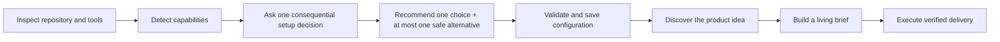
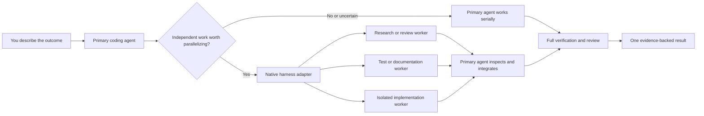

# Ultimate Agent Stack

[](https://www.npmjs.com/package/ultimate-agent-stack)
[](https://github.com/samtay32/ultimate-agent-stack/actions/workflows/ci.yml)
[](LICENSE)
[](package.json)

A guarded npm-installed operating system for software agents. It turns a
plain-language idea into a shaped, implemented, verified, review-ready change
while leaving the human only genuine product and authority decisions. Guided
onboarding recommends safe choices in plain language, and provider adapters
keep review and organizational memory replaceable.

It cannot make every project perfect. It makes completion testable through
locked intent, project-native checks, independent review, evidence, and explicit
residual risk.

The package is not the coding model. Codex, Claude, Cursor, Grok, or another
capable agent supplies the intelligence. Ultimate Agent Stack installs the
project-owned operating contract, durable state, mechanical guardrails, and
definition of done that keep that agent aligned from idea through review.

## Choose Your Path

| If you are... | Start here | What you need to know |
|---|---|---|
| A non-coder with an idea | Give the conversational prompt below to your coding agent | Describe the result you want. The agent explains important choices in plain language and handles routine setup, implementation, testing, and documentation. |
| A coder adding it to a project | Run the three commands below | The stack detects and wraps your existing tools; it does not replace your framework, tests, CI, or architecture. |
| A maintainer evaluating trust | Read [Guardrails Behind the Scenes](#guardrails-behind-the-scenes) and [the architecture](docs/ARCHITECTURE.md) | The CLI has no runtime dependencies, writes are containment-checked, verification fails closed, and upstream code never updates automatically. |

## The Three Commands

Open a terminal in a dedicated project folder and use:

```bash
# Install into this project
npx -y ultimate-agent-stack@latest init

# Check that the project is safely configured
npx -y ultimate-agent-stack@latest doctor

# Safely update later
npx -y ultimate-agent-stack@latest upgrade
```

On a new install, `doctor` intentionally reports onboarding as pending until the
coding agent has explained and recorded the profile/provider choices. It is a
safety prompt, not a setup failure.

You can also tell a capable coding agent:

```text
Set up Ultimate Agent Stack in this project. My idea is: [describe the outcome].
Use the installed conversational workflow. For each consequential decision,
recommend one safe choice, offer at most one genuinely safe alternative, and
handle all routine technical work.
```

The agent runs the commands, detects available capabilities, completes guided
onboarding, reviews project checks, fixes the baseline, invokes
`$run-autonomous-delivery`, and starts the product conversation.
[STARTER_PROMPT.md](STARTER_PROMPT.md) contains the full operating contract when
a harness needs an explicit prompt.

## Guided Setup, Then Project Discovery

The package CLI stays non-interactive and deterministic. Your coding agent owns
the conversation:



Setup asks only about choices that affect project risk, external data, review,
memory, or authority. Afterward, project discovery asks only unanswered
questions that materially change the product. Ordinary frameworks, commands,
tests, and reversible implementation details remain the agent's responsibility.

You can reply `use the recommendation`. If only one safe option exists, the
agent says so instead of inventing an unsafe alternative. The approved
configuration is fingerprinted; provider or authority changes make `doctor`
fail until reviewed and approved again.

## Replaceable Review and Knowledge Adapters

Ultimate Agent Stack depends on capabilities, not vendor names:

| Capability | Built-in choice | Optional adapters | Governing rule |
|---|---|---|---|
| Independent review | Repository-owned standards and intent review | CodeRabbit or an allowed GitHub human reviewer | Production profiles require a current external review, but CodeRabbit itself is replaceable |
| Project knowledge | Locked artifacts, decisions, evidence, and Git history | GBrain | Memory is advisory, never a release dependency, and always falls back to repository state |
| Coding harness | Portable `AGENTS.md`, skills, and serial execution | Codex, Claude Code, Gemini, Grok, Cursor, OpenCode, and future harnesses | Harness capability may optimize execution but cannot expand authority |

GBrain is supported only as a narrow, optional knowledge adapter. The package
does not install its complete skill collection, autonomous queue, dream cycle,
or updater. Retrieved knowledge must retain provenance and be validated against
current repository evidence. Capture is limited to redacted, verified learning;
skills are proposed as non-executable candidates and require evaluations plus a
normal reviewed change before activation.

See [Review and Knowledge Adapters](docs/ADAPTERS.md) for the configuration,
evidence, failure, and future-provider contracts.

## How It Works


The human stays at the two points where human judgment matters: defining the
outcome and exercising real-world authority. Between them, the agent follows a
durable, inspectable workflow rather than improvising an unbounded autonomous
loop.

## One Conversation, Automatically Managed Subagents

You still talk to one primary coding agent. For each shaped request, that agent
now applies `$coordinate-parallel-delivery` and decides whether native
subagents would actually shorten the work. When they help, the primary agent
creates their assignments, monitors them, handles failures, integrates their
results, verifies the combined change, and closes them. You do not become the
project manager for a collection of bots.



This is adaptive parallel delivery, not a mandatory swarm:

- the default cap is three workers, configurable only within a safe limit;
- workers cannot create more workers or gain authority the primary agent lacks;
- read-only tasks may share a checkout, but parallel writes require verified
  separate worktrees or harness-isolated workspaces;
- coupled work, small work, unsupported harnesses, and uncertain isolation stay
  serial automatically;
- every worker result is treated as untrusted until the primary agent inspects
  and verifies it.

The core contract is harness-agnostic. The package ships conservative native
read-only worker profiles for
[Codex](https://developers.openai.com/codex/subagents/),
[Gemini CLI](https://github.com/google-gemini/gemini-cli/blob/main/docs/core/subagents.md),
and [OpenCode](https://opencode.ai/docs/agents/), plus
[Claude Code](https://code.claude.com/docs/en/sub-agents) when initialized with
`--claude`. Grok, Cursor, and other agents use the same portable rules and may
use a native delegation surface only when its current capability and isolation
are known; otherwise they fall back to serial execution. Ultimate Agent Stack
does not launch one vendor's CLI from another or add a separate orchestration
framework to the project.

## Built From Research, Finished With Original Engineering

Ultimate Agent Stack is not a fork, wrapper bundle, or repackaging of the
projects below. It is an original synthesis: useful patterns were compared,
adapted into one portable workflow, and then surrounded with a new
dependency-free CLI, safety policy, approval model, state format, tests,
maintenance process, and release system. No third-party source file is included.
Repository popularity helped identify valuable research; it did not make every
feature safe, portable, or appropriate to combine.


### Primary design lineage

| Repository | What the original project does | What this stack adapts | What is not bundled |
|---|---|---|---|
| [kunchenguid/firstmate](https://github.com/kunchenguid/firstmate) | Runs a crew of supervised coding agents in isolated sessions and worktrees behind one human-facing first mate | One primary coordinator, bounded native subagents for useful independent work, resumable repository state, verified write isolation, and serial fallback | Mandatory agent swarms, tmux or another session backend, fixed worker personas, and a permanent supervisor |
| [kunchenguid/lavish-axi](https://github.com/kunchenguid/lavish-axi) | Lets humans review and annotate agent-generated HTML and Mermaid artifacts in a local visual editor | A fidelity ladder that uses diagrams, comparisons, or disposable prototypes when prose cannot resolve a decision | A required visual editor, HTML planning for every task, or another runtime dependency |
| [kunchenguid/no-mistakes](https://github.com/kunchenguid/no-mistakes) | Gates pushes through an isolated validation, repair, and clean-PR pipeline | Locked intent, fail-closed verification, independent standards and intent review, evidence, and explicit finding disposition | Its Git proxy remote or complete runtime as a requirement for every repository |
| [kunchenguid/axi](https://github.com/kunchenguid/axi) | Defines agent-native command interfaces with compact output, predictable errors, and contextual next actions | Structured command arrays, deterministic exit codes, bounded and redacted evidence, loud failures, and safe repeatability | A wrapper for every external tool or unverified universal efficiency claims |
| [GitHub/spec-kit](https://github.com/github/spec-kit) | Provides a specification-driven lifecycle from project principles through requirements, plans, tasks, analysis, and implementation | Stable capability IDs, measurable acceptance, non-goals, traceability, and consistency checks | Full specification ceremony for small fixes or specifications as a substitute for runnable evidence |
| [mattpocock/skills](https://github.com/mattpocock/skills) | Provides composable engineering skills for questioning, research, prototypes, specifications, TDD, debugging, and review | Research before questions, one high-impact clarification at a time, tracer slices, public test seams, and independent review | The entire skill catalog, long interviews by default, or keeping disposable prototype code |
| [bmad-code-org/bmad-method](https://github.com/bmad-code-org/bmad-method) | Provides a broad, scale-adaptive development framework with planning, architecture, implementation, testing, and specialist roles | Risk-scaled shaping, binding architecture decisions, readiness checks, and bounded repair loops | Persona and party-mode machinery, a separate agent for every role, and a large mandatory document catalog |
| [garrytan/gbrain](https://github.com/garrytan/gbrain) | Provides a long-lived knowledge store with retrieval, synthesis, provenance, graph relationships, and optional agent integrations | An optional provider-neutral knowledge plane, repository fallback, scoped retrieval, verified capture, and evaluated skill candidates | Its full skill pack, ambient capture, dream/autopilot loops, updater, agent queue, or treating memory as current truth |

Firstmate continues to evolve beyond the pinned revision used for this
synthesis. Its reviewed Kimi CLI and tmux adapter changes remain **deferred**:
they are useful for Firstmate operators, but would couple this package to
another supervisor and session backend. The package instead uses an original,
portable coordination contract that uses each supported coding harness's native
subagent capability and retains a safe serial fallback.

### What is original in this package

- one scale-adaptive conversation that works for non-coders and experienced
  engineers without pretending they need the same amount of ceremony;
- a containment-checked installer and local project CLI with tamper-resistant
  approvals, canonical policy verification, intent locks, and secret-isolated
  evidence;
- ten composable skills that connect shaping, knowledge hygiene, adaptive parallel coordination,
  vertical delivery, conditional security, verification, review closure, and
  maintenance into one flow;
- safe upgrades that propose reconciliations instead of overwriting project
  decisions;
- project-native verification discovery across common ecosystems, with
  definition fingerprints that prevent an approved script name from hiding
  changed behavior;
- a read-only upstream watcher and human-reviewed adoption policy;
- an npm/GitHub release chain designed around protected branches, OIDC,
  provenance, staged publishing, 2FA approval, and no long-lived publish token.

<!-- markdownlint-disable MD033 -->
<details>
<summary>Supporting repository audit (all additional repositories)</summary>

These repositories refined individual decisions without becoming runtime
dependencies:

| Repository | Focus carried into the evaluation |
|---|---|
| [kunchenguid/treehouse](https://github.com/kunchenguid/treehouse) | Leased, recoverable worktree isolation |
| [kunchenguid/gnhf](https://github.com/kunchenguid/gnhf) | Bounded autonomous iterations and rollback |
| [kunchenguid/gh-axi](https://github.com/kunchenguid/gh-axi) | Compact, structured GitHub operations |
| [kunchenguid/chrome-devtools-axi](https://github.com/kunchenguid/chrome-devtools-axi) | Observable browser evidence |
| [kunchenguid/agent-browser-axi](https://github.com/kunchenguid/agent-browser-axi) | Accessibility-oriented browser snapshots |
| [kunchenguid/quota-axi](https://github.com/kunchenguid/quota-axi) | Cost visibility and explicit time bounds |
| [kunchenguid/tasks-axi](https://github.com/kunchenguid/tasks-axi) | Idempotent durable task state |
| [kunchenguid/rough-cut-axi](https://github.com/kunchenguid/rough-cut-axi) | Plain-file truth and structured decisions |
| [kunchenguid/mcp-compressor](https://github.com/kunchenguid/mcp-compressor) | Task-relevant tools and context cost |
| [kunchenguid/acpx](https://github.com/kunchenguid/acpx) | Structured delegation and persistent sessions |
| [kunchenguid/superpowers-bench](https://github.com/kunchenguid/superpowers-bench) | Measured skill discovery |
| [kunchenguid/ProgramBench](https://github.com/kunchenguid/ProgramBench) | Executable behavioral evaluation |
| [kunchenguid/harness-exam](https://github.com/kunchenguid/harness-exam) | Clean-repository and fail/pass harness fixtures |

</details>
<!-- markdownlint-enable MD033 -->

The exact revisions, video research, platform documentation, adopted ideas,
rejected complexity, and Firstmate/Kimi decision are recorded in
[Sources, Synthesis, and Tradeoffs](docs/SOURCES_AND_TRADEOFFS.md). That file is
the evidence ledger; this README is the useful map.

## What the Agent Owns

- project and authoritative-source research;
- setup, requirements shaping, and safe reversible assumptions;
- architecture, implementation, tests, docs, and migrations;
- deterministic local verification;
- pull-request preparation and bounded review repair;
- decisions, evidence, and resumable repository state.

The human supplies the desired outcome and retains authority over credentials,
spending, legal or licensing acceptance, destructive production actions,
material unresolved risk, and external merge, deployment, release, or
publication unless project policy explicitly grants it.

## Guardrails Behind the Scenes

- The stack's own setup and state writes remain inside the selected project,
  reject symlink escapes, and reject broad targets such as the filesystem root
  or home folder.
- Install and update never overwrite an existing differing managed file.
  Changes are proposed under `.agent-stack/update-proposals/<version>/` for the
  agent to reconcile.
- Removed package files are recorded, not deleted automatically.
- Protected safety policy and the local CLI are checked against canonical bytes
  from the executing reviewed package, not a project-editable manifest.
- Direct shell interpreters and known destructive commands are rejected.
  Delegated package scripts are fingerprinted with their exact script
  definitions and require reapproval when those definitions change.
- Quality checks receive a scrubbed environment without inherited credentials.
  They remain executable project code and should run inside the agent
  harness's OS or container sandbox when the project is not already trusted.
- Missing, skipped, timed-out, or failed required checks fail closed.
- A protected provider-aware review-receipt check rejects absent, stale,
  change-requested, or unresolved required reviews. CodeRabbit rate-limit
  comments never count; allowed GitHub human reviews must be current approvals.
- Guided profile, provider, external-data, and authority choices are
  fingerprinted. Silent configuration changes invalidate approval.
- Knowledge is treated as untrusted advisory context. Retrieval requires
  provenance and current-evidence validation; capture requires verification,
  redaction, and repository fallback.
- Intent locks detect silent requirement or architecture drift.
- Parallel delivery is bounded by protected policy: the primary agent owns
  delegation and integration, workers cannot recursively delegate or expand
  authority, parallel writes require isolation, and unavailable or unsafe
  parallelism falls back to serial work.
- Captured command output is bounded and secret-like assignments are redacted.
- `$secure-launch` derives authentication, tenant isolation, privacy, abuse,
  cost, dependency, and supply-chain gates only when the project exposure makes
  them applicable.
- Upstream repositories are read-only research inputs; changes never flow into
  the package automatically.
- Accidental direct npm publication fails closed. The first release uses a
  documented owner/2FA bootstrap; later releases use protected stage-only
  trusted publishing and human npm approval. A commit-bound draft GitHub
  Release is then published automatically only after npm exposes the matching
  version and provenance.

These controls protect a non-technical owner without asking them to approve
technical details they cannot reasonably evaluate. The agent must translate an
unsafe request into the closest safe outcome and explain the difference plainly.

## Agent and Maintainer Commands

Projects receive a self-contained local CLI:

```bash
node .agent-stack/bin/agent-stack.mjs status
node .agent-stack/bin/agent-stack.mjs capabilities
node .agent-stack/bin/agent-stack.mjs configure \
  --profile standard \
  --review builtin \
  --knowledge repository \
  --knowledge-scope project \
  --external-data local_only \
  --reason "Approved safe local defaults for this project"
node .agent-stack/bin/agent-stack.mjs detect --write
node .agent-stack/bin/agent-stack.mjs approve-checks \
  --reason "Inspected project-native quality command definitions"
node .agent-stack/bin/agent-stack.mjs verify
node .agent-stack/bin/agent-stack.mjs lock
node .agent-stack/bin/agent-stack.mjs check-lock
```

Package maintainers use:

```bash
npm run upstream:check
npm run release:check
```

`$maintain-agent-stack` governs source review, workflow changes, SemVer,
tarball testing, and release preparation. A weekly GitHub workflow opens or
updates a review issue when pinned upstream repositories change. It never
copies, executes, merges, or publishes upstream code.

## Package Contents

- `skills/`: ten validated Agent Skills, including setup, project knowledge,
  secure launch, adaptive parallel coordination, delivery, verification,
  review closure, and maintenance.
- `bin/ultimate-agent-stack.mjs`: dependency-free Node.js CLI.
- `assets/project-template/`: protected policy, planning artifacts, PR
  template, CodeRabbit configuration, review-receipt workflow, and harness
  adapters.
- `sources/upstreams.json`: pinned read-only research sources.
- `.github/workflows/`: CI, weekly upstream watch, and protected npm publish.
- `test/`: deterministic safety and lifecycle tests.
- `docs/`: architecture, operating manual, review loop, and source tradeoffs.

The no-code publishing handoff is in [docs/RELEASE.md](docs/RELEASE.md).

## Requirements

- Node.js 20.12 or newer;
- Git for normal delivery;
- project-native tools for the detected checks;
- `gh` or a connected GitHub integration for the pull-request phase;
- CodeRabbit, an approved GitHub human reviewer, or another future adapter when
  the selected project profile requires external review;
- GBrain only when cross-session or cross-project memory is selected.

There are no runtime npm dependencies and no install lifecycle scripts. The
only publication lifecycle hook is a fail-closed `prepublishOnly` guard.

## Validate This Package

```bash
npm ci --ignore-scripts
npm run release:check

for skill in skills/*; do
  uv run --with pyyaml python \
    ~/.codex/skills/.system/skill-creator/scripts/quick_validate.py "$skill"
done

uv run --with pyyaml python \
  ~/.codex/skills/.system/plugin-creator/scripts/validate_plugin.py .

npx --yes markdownlint-cli2@0.20.0 '**/*.md'
```

No third-party source file was copied into this package. The workflows are an
original synthesis of the sources documented in
[docs/SOURCES_AND_TRADEOFFS.md](docs/SOURCES_AND_TRADEOFFS.md).
