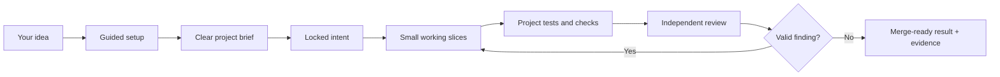

# Ultimate Agent Stack

[](https://www.npmjs.com/package/ultimate-agent-stack)
[](https://github.com/samtay32/ultimate-agent-stack/actions/workflows/ci.yml)
[](LICENSE)
[](package.json)

Ultimate Agent Stack gives a coding agent a clear path from your idea to a
tested, reviewed result. It installs project rules, reusable skills, safety
checks, and durable progress files through one npm package.

You describe the outcome. The agent handles setup, planning, coding, tests,
documentation, and review. You keep control of credentials, spending, legal
choices, destructive production actions, merging, and publishing.

> **Honest boundary:** this package can enforce the rules owned by its CLI. It
> cannot force every coding agent to follow written instructions, and it is not
> an operating-system sandbox. See [What Is Actually Enforced](docs/TRUST.md).

## Start in 30 Seconds

Open or create a dedicated project folder in Codex, Claude Code, Cursor,
Gemini, Grok, OpenCode, or another capable coding agent. Paste:

```text
Set up Ultimate Agent Stack in this project. My idea is: [describe the result].
If this is a simple project, recommend the simple setup. For every decision I
actually need to make, recommend one safe choice and handle the technical work.
```

The agent installs the stack, checks the project, recommends safe defaults, and
asks one important question at a time. You can answer:

```text
Use the recommendation.
```

The agent then shapes the idea, builds it in small working pieces, runs the
project's real checks, prepares a pull request, and closes valid review
findings.

No coding knowledge is required for this path. The
[plain-language operating manual](docs/OPERATING_MANUAL.md) explains what to
expect.

## Three Commands

Coders and maintainers can run the CLI directly:

```bash
# Add the stack to the current project
npx -y ultimate-agent-stack@latest init

# See whether setup and safety checks are ready
npx -y ultimate-agent-stack@latest doctor --human

# Update safely later
npx -y ultimate-agent-stack@latest upgrade
```

The CLI is non-interactive. The coding agent runs the guided conversation and
records the choices you approve. Existing files are preserved when they differ;
updates create proposals for review instead of overwriting them.

## What You Will Be Asked

The agent asks only when your answer changes the product, risk, outside data,
review provider, memory provider, or authority.

It may ask:

- What result do you want?
- Who will use it?
- Are outside services or data allowed?
- Does a production release need independent review?
- May it merge after every required check passes?

It should not ask you to choose routine frameworks, write test commands, manage
subagents, or interpret configuration files. It recommends one safe choice and
at most one useful alternative.

## How Delivery Works



The workflow scales with risk. A small local tool gets a short brief. A public,
paid, sensitive, or hard-to-reverse system gets deeper planning and stronger
gates.

When parallel work is useful, the primary agent may use a few isolated native
subagents. The primary agent owns their instructions, integration, checks, and
cleanup. If safe isolation is unavailable, work stays serial.

## What Gets Installed

| Part | Purpose |
|---|---|
| Project rules | Keep scope, authority, and completion standards visible |
| Guided skills | Shape, build, verify, review, secure, and maintain the project |
| Local CLI | Detect checks, protect approvals, lock intent, and record evidence |
| Progress files | Preserve decisions and allow another session to resume |
| Harness adapters | Use supported native agent features without changing authority |
| Review gate | Require current review evidence when project policy calls for it |

The package has no runtime dependencies and no install hook. It does not run a
cloud agent service, add a database, or replace your project's own tests and
CI.

## Replaceable Adapters

The core workflow depends on capabilities, not vendor names.

| Capability | Built-in path | Optional adapter |
|---|---|---|
| Coding agent | Portable project rules and serial execution | Native Codex, Claude Code, Gemini, OpenCode, Cursor, or other supported features |
| Independent review | Repository standards and intent review | CodeRabbit or an approved GitHub human |
| Project knowledge | Repository files, evidence, and Git history | GBrain |

Optional providers cannot expand authority. A missing knowledge provider falls
back to repository state. A required review provider fails closed.

## Safety in Plain Language

The CLI checks the controls it owns:

- Setup and state writes must remain inside the chosen project.
- Symlink escapes and broad targets are rejected.
- Protected policy and CLI files are checked against package source.
- Changed check commands or package scripts require approval again.
- Missing, failed, skipped, or timed-out required checks block completion.
- Changed project intent is detected through locked file hashes.
- Required review must be current with no unresolved actionable thread.
- Updates preserve local changes and never silently delete old package files.

Checks are still executable project code. They must run inside the sandbox and
permissions supplied by your coding tool or operating system.

For the exact boundary—including which promises are hard controls and which are
instructions to the agent—read [Trust and Safety Boundaries](docs/TRUST.md).

## Built From Prior Art

Design patterns were studied across Firstmate, No Mistakes, Axi, GitHub
Spec Kit, Matt Pocock's skills, BMAD Method, GBrain, related repositories, and
official platform guidance. Ultimate Agent Stack adapts selected ideas into an
original package; it does not bundle their source code or runtimes.


The full ledger records exact revisions, useful ideas, rejected complexity,
videos, platform references, and tradeoffs:
[Sources, Synthesis, and Tradeoffs](docs/SOURCES_AND_TRADEOFFS.md).

## Documentation

| Read this | When you need |
|---|---|
| [Operating Manual](docs/OPERATING_MANUAL.md) | Plain-language setup, daily use, recovery, and updates |
| [Trust and Safety Boundaries](docs/TRUST.md) | Exact enforcement, limitations, and threat model |
| [Architecture](docs/ARCHITECTURE.md) | Control flow, state, planes, and component design |
| [Skill Stack](docs/SKILL_STACK.md) | Skill roles and harness-specific behavior |
| [Adapters](docs/ADAPTERS.md) | Review and knowledge provider configuration |
| [GitHub Review Loop](docs/GITHUB_LOOP.md) | Pull requests, CodeRabbit, CI, and closure rules |
| [Release Guide](docs/RELEASE.md) | Maintainer publishing and provenance checks |
| [Sources and Tradeoffs](docs/SOURCES_AND_TRADEOFFS.md) | Research lineage and adoption decisions |

## Requirements

- Node.js 20.12 or newer.
- Git.
- A capable coding agent or a developer running the CLI.
- Project-native checks before the project can be declared ready.

## Maintainer Checks

```bash
npm run release:check
npx --yes markdownlint-cli2@0.20.0 '**/*.md'
```

Releases use protected GitHub Actions, npm trusted publishing, staged human 2FA
approval, registry provenance, and a matching GitHub Release.

## License

[MIT](LICENSE)
