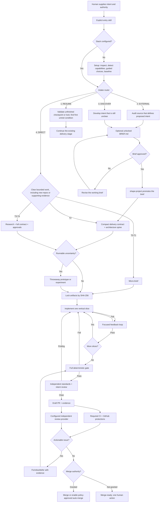
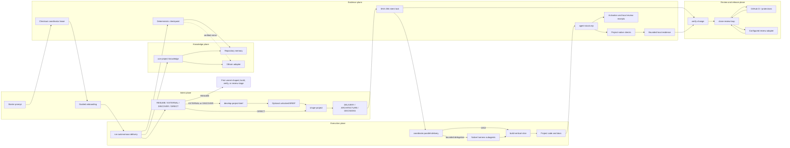

# Architecture

## System in One Sentence

Ultimate Agent Stack is a repository-owned control loop: it turns intent into a locked contract, executes verifiable slices, gathers independent evidence, and repairs review findings until policy—not agent confidence—says the change is ready.

## Control Flow

`RESUME` continues at the first unmet done, acceptance, or evidence condition,
which may be shaping, implementation, verification, or review rather than the
first downstream node shown in the simplified diagram. A completed checkpoint
and fully satisfied active lock do not absorb an unrelated new request. An
active lock takes precedence only while a locked condition remains unmet.
Conflicting new intent is surfaced as an audited change rather than silently
reopening a closed decision. A supporting screenshot, log, or attachment does
not turn clear bounded work into EXTERNAL, and clear bounded work remains DIRECT
in a new or empty repository.

The end-to-end `run-autonomous-delivery` controller owns the implementation and
verification gates represented by this flow. `build-vertical-slice` and
`verify-change` remain available as direct entry points for requests explicitly
limited to those phases; an otherwise correct controller run does not require
nested native activation of either phase skill.

## Component Architecture

## Seven Planes

1. **Configuration plane** — detects project capabilities, asks only
   consequential setup questions, recommends safe choices, and fingerprints the
   approved profile, providers, external-data policy, and authority mode.
2. **Intent plane** — routes recovery and new input before scaling ceremony.
   `EXTERNAL` uses an unlocked working brief when supplied material defines
   proposed intent; `DISCOVER` uses it when intent still needs development;
   `DIRECT` keeps the existing micro-brief or compact-contract path; `RESUME`
   continues only unfinished settled work. Canonical shaping separates user outcome, capabilities,
   constraints, non-goals, assumptions, closed decisions, and acceptance.
3. **Knowledge plane** — retrieves scoped advisory context and captures only
   verified, provenance-backed learning. Repository state is authoritative and
   remains the fallback for optional providers such as GBrain.
4. **Execution plane** — builds one vertical slice at a time. It uses the
   repository's language, framework, and tools rather than imposing a stack.
5. **Evidence plane** — provides deterministic setup, check discovery,
   fail-closed verification, bounded logs, and artifact hashes. It deliberately
   contains no LLM decision logic.
6. **Review plane** — independently checks engineering standards and locked
   intent, then uses the configured independent review adapter as an additional
   adversarial surface when required.
7. **Authority plane** — limits interruptions without pretending authority does
   not exist. Reversible engineering is agent-owned; credentials, cost, legal
   risk, destructive production actions, and unauthorized releases remain
   human-owned.

## Durable State

| State | Owner | Purpose |
|---|---|---|
| `AGENTS.md` | Repository | Always-on project rules and authority boundaries |
| `.agent-stack/config.json` | Repository | Actual command arrays and automation policy |
| `.agent-stack/core-policy.json` | Package | Protected mechanical safety rules |
| `.agent-stack/installation.json` | CLI | Managed hashes, customizations, and update proposals |
| `BRIEF.md` | Brief development | Optional unlocked source audit and working brief for `EXTERNAL` or `DISCOVER` intake |
| `DELIVERY.md` | Delivery | Outcome, capabilities, acceptance, non-goals |
| `ARCHITECTURE.md` | Delivery | Binding architecture decisions only |
| `DECISIONS.md` | Delivery | Closed product decisions and audited changes to previously locked intent |
| `VERIFICATION.md` | Delivery | Requirement-to-evidence coverage |
| `SECURITY.md` | Delivery | Classified exposure and applicable launch gates |
| `.agent-stack/artifacts/DELEGATION.md` | Primary agent | Execution strategy, worker assignments, and dispositions |
| `.agent-stack/state.json` | CLI | Active hashes and lock history |
| `.agent-stack/checkpoint.json` and `CHECKPOINT.md` | CLI | Integrity-bound cross-conversation handoff |
| `.agent-stack/coordinator.json` | Local CLI state | Expiring ownership lease for one Project Steward in a checkout; ignored by Git |
| `.agent-stack/gbrain-home/` | Optional local adapter | Checkout-scoped PGLite memory; ignored by Git |
| `.agent-stack/runs/` | Local evidence | Bounded command results; ignored by default |
| `.agent-stack/campaign.json` | CLI and Project Steward | Tracked one-item-at-a-time campaign state with a hard iteration bound |
| `.agent-stack/provider-receipts/` | CLI | Tracked bounded receipts for every enabled external work-provider write attempt |
| Pull request | GitHub | Reviewable outcome, evidence, and disposition ledger |

The configuration stores guided-interaction invariants, selected providers, and
an approval hash. Changing provider, profile, external-data, execution, merge,
or parallel-delivery policy invalidates approval. `doctor` fails before
delivery continues.

`BRIEF.md` is not another delivery state machine and is not required for a
clear bounded change. It remains unlocked while the Project Steward audits or
develops intent. Approval changes its working status but does not
cryptographically authenticate the approver. `shape-project` promotes an
approved brief into the canonical delivery, architecture, security, decision,
and verification artifacts. EXTERNAL or DISCOVER promotion explicitly locks
all five of those canonical contracts while leaving the brief unlocked. A
proportionate DIRECT T0/T1 change may retain the configured smaller lock
selection. Artifact declarations use only `DRAFT` or `APPROVED`; the protected
CLI records lock state separately in `.agent-stack/state.json`. A lock refusal
does not grant authority to rewrite the artifact's approval or conflict
declarations.

## Decision Semantics

Closed product decisions record the decision, the alternatives it forecloses,
its evidence or authority, and the rule that it must not be reopened without
product-owner instruction. Shaping, implementation, verification, and review
read these decisions before proposing alternatives.

A material change to settled intent is a separate audited record containing the
prior decision, new decision, reason, authority, consequence, and date. When
that change affects a locked contract, the Project Steward must unlock with a
reason, update the canonical artifacts, and lock them again. The brief may
retain the provenance and reconciliation history, but `DECISIONS.md` and the
locked delivery artifacts remain authoritative after promotion.

## Provider Boundaries

| Capability | Baseline | Optional provider | Failure behavior |
|---|---|---|---|
| Review | Built-in standards and intent review | CodeRabbit or allowed GitHub human | A required provider fails closed; a stale review never counts |
| Knowledge | Project-scoped repository instructions, artifacts, evidence, and Git | Project- or organization-scoped GBrain | Warn, retain provenance, and continue with repository fallback |
| Telemetry | Repository and deployment evidence | Zero or more reviewed read-only product, error, service, or AI providers | Warn, retain bounded references, and continue with repository fallback |
| Work | Portable repository ledger and evidence graph | Scoped Linear reading plus optional receipted issue/comment creation; future reviewed providers use the same contract | Continue from the repository mirror; never expand delivery authority |

Provider configuration is declarative and validated by package code. A
repository cannot add an arbitrary executable adapter merely by naming it in
JSON. Supporting another provider requires a normal reviewed package change.

External memory never owns product truth or release authority. Its output is
untrusted data until validated against current repository evidence. Capture is
limited to redacted verified learning; skill candidates remain non-executable
until reviewed and evaluated.

External telemetry is also advisory. It acts as a sensor that may support
diagnosis, prioritization, or post-release comparison. The core stores provider
identity, scope, bounded references, time windows, limitations, and repository
validation—not credentials or raw remote payloads. No telemetry provider may
expand authority or become a mandatory delivery dependency.

The initial provider registry contains PostHog for product telemetry, Sentry
for error telemetry, and New Relic for service telemetry. A source-hash-pinned
project helper performs only fixed project/account health checks against
reviewed official endpoints. It rejects redirects and custom hosts, bounds
responses, and discards provider payloads. OpenTelemetry may carry project
signals to any approved backend, but instrumentation and routing remain outside
this adapter layer.

Work tracking uses one normalized contract regardless of provider. The
repository ledger contains bounded objectives, acceptance criteria, scope,
dependencies, status, and external references. The evidence graph connects
those items to intent, requirements, decisions, files, tests, commits, pull
requests, review, release, checkpoints, and telemetry. It also stores bounded
agent-recorded skill activation entries bound to the installed skill path and
hash. It stores references and short redacted summaries, not copies of remote
systems. The graph is derived evidence navigation; referenced artifacts and
native harness traces remain authoritative.

`evidence report` derives a provider-neutral summary from those two validated
files. JSON output contains only counts and bounded identifier samples. Mermaid
output uses generated aliases and sanitized labels, includes only edges between
selected nodes, is capped at 500 nodes, and applies an aggregate edge cap equal
to four times the selected-node count. It reports node-bound and selected-node
edge-cap omissions separately. Report output rejects symlinked path components
observed before creation. It does not claim race-safe confinement against
another process with checkout write access. Reports do not query providers and
do not promote a reference into proof.

The Linear adapter is not a second orchestrator. Its fixed, paginated query
shape checks viewer authentication and configured team visibility. Optional
write helpers expose only deterministic issue creation and evidence-comment
creation, with separate credentials, explicit authority, reconciliation, and
repository receipts. Campaign advancement and provider synchronization remain
separate operations. The official read-only MCP endpoint is an optional
harness-owned connection. Native Linear Agent sessions and Agent Auth remain
outside the current architecture.

## Continuity and Checkout Ownership

`start` is the continuity entrypoint. It validates and loads the current
checkpoint, performs the configured memory health/retrieval test, and acquires
or resumes an expiring coordinator lease. The lease stores only a token hash;
the primary Project Steward retains the bearer token. A competing conversation
is rejected while the lease is active. Explicit takeover requires confirmation
that the old coordinator stopped.

`checkpoint` requires the active coordinator token. It accepts bounded
single-line facts, rejects common secret shapes, records current Git state,
writes JSON plus a readable Markdown handoff, and hashes the semantic content.
If project-scoped GBrain is configured and healthy, that checkpoint is mirrored
to a fixed page. Repository state remains authoritative if retrieval fails or
the mirror differs.

Subagents do not receive the coordinator token. They are bounded workers behind
the Project Steward and cannot write the checkpoint or release the lease.
Parallel writers still require separate isolated workspaces.

## Why It Adapts

The workflow branches on risk, ambiguity, blast radius, and reversibility—not framework or industry. Project-specific behavior lives in `AGENTS.md`, configured command arrays, locked artifacts, and tests. The same control loop can therefore govern a website, CLI, API, data pipeline, mobile app, infrastructure repository, document-only project, or brownfield system.

It is not literally universal: a project without executable checks, a required unavailable service, missing credentials, or an unresolved product decision cannot be truthfully declared ready. The system turns those into explicit blockers rather than hidden failure.

## Parallelism

The configured default is adaptive: the primary agent chooses the lowest
capability level that safely helps the current request.

| Level | Execution |
|---|---|
| C0 | Primary agent works serially |
| C1 | Native workers perform parallel read-only research or review in the shared checkout |
| C2 | Native workers perform disjoint writes in verified isolated worktrees/workspaces |

The primary agent always owns decomposition, worker prompts, monitoring,
recovery, integration, verification, and cleanup. Worker count is capped;
nested delegation and authority expansion are forbidden; a branch alone is not
write isolation. The strategy falls back to serial work when tasks are coupled,
the expected saving is small, or the harness cannot prove the required
capability.

This is a portable coordination protocol with native read-only worker adapters
for Codex, Claude Code, Gemini CLI, and OpenCode. Grok, Cursor, and other
harnesses can use a proven native delegation surface or the serial fallback. It
is not a bundled agent framework, always-running supervisor, tmux dependency,
or cross-vendor CLI launcher.

## Package and Upgrade Boundary

The npm package is a distribution vehicle, not a remote orchestration service.
The current primary coding agent is the coordinator. `init`
copies the portable policy, skills, artifacts, and dependency-free CLI into the
project. The project then remains runnable from repository-owned files.

Every shipped file is recorded with its package-source hash and last accepted
project hash. `upgrade` creates a versioned proposal for every existing file
whose bytes differ from the new package source; project-editable manifest
claims never authorize an overwrite. Package removals become recorded orphans
rather than automatic deletions. The package CLI verifies protected policy and
CLI bytes against its canonical source, and protected files cannot be adopted
in a customized state.

Pinned upstream repositories sit outside this path. The scheduled monitor may
open a review issue, but only the explicit maintenance workflow can translate a
reviewed principle into original package code.
