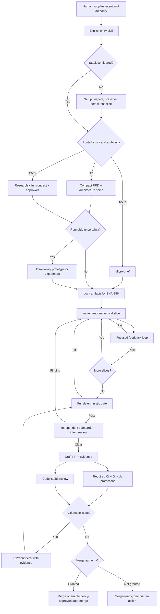
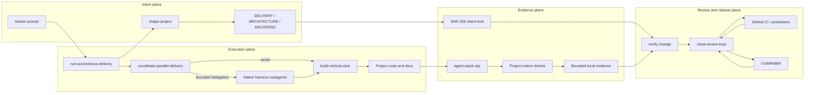

# Architecture

## System in One Sentence

Ultimate Agent Stack is a repository-owned control loop: it turns intent into a locked contract, executes verifiable slices, gathers independent evidence, and repairs review findings until policy—not agent confidence—says the change is ready.

## Control Flow

## Component Architecture

## Five Planes

1. **Intent plane** — separates user outcome, capabilities, constraints, non-goals, assumptions, and acceptance. It scales from a micro-brief to a full product/migration contract.
2. **Execution plane** — builds one vertical slice at a time. It uses the repository's own language, framework, and tools rather than imposing a product stack.
3. **Evidence plane** — provides deterministic setup, check discovery, fail-closed verification, bounded logs, and artifact hashes. It deliberately contains no LLM decision logic.
4. **Review plane** — independently checks engineering standards and locked intent, then uses GitHub and CodeRabbit as additional adversarial surfaces.
5. **Authority plane** — limits interruptions without pretending authority does not exist. Reversible engineering is agent-owned; credentials, cost, legal risk, destructive production actions, and unauthorized releases remain human-owned.

## Durable State

| State | Owner | Purpose |
|---|---|---|
| `AGENTS.md` | Repository | Always-on project rules and authority boundaries |
| `.agent-stack/config.json` | Repository | Actual command arrays and automation policy |
| `.agent-stack/core-policy.json` | Package | Protected mechanical safety rules |
| `.agent-stack/installation.json` | CLI | Managed hashes, customizations, and update proposals |
| `DELIVERY.md` | Delivery | Outcome, capabilities, acceptance, non-goals |
| `ARCHITECTURE.md` | Delivery | Binding architecture decisions only |
| `DECISIONS.md` | Delivery | Audited changes to intent or architecture |
| `VERIFICATION.md` | Delivery | Requirement-to-evidence coverage |
| `SECURITY.md` | Delivery | Classified exposure and applicable launch gates |
| `DELEGATION.md` | Primary agent | Execution strategy, worker assignments, and dispositions |
| `.agent-stack/state.json` | CLI | Active hashes and lock history |
| `.agent-stack/runs/` | Local evidence | Bounded command results; ignored by default |
| Pull request | GitHub | Reviewable outcome, evidence, and disposition ledger |

## Why It Adapts

The workflow branches on risk, ambiguity, blast radius, and reversibility—not framework or industry. Project-specific behavior lives in `AGENTS.md`, configured command arrays, locked artifacts, and tests. The same control loop can therefore govern a website, CLI, API, data pipeline, mobile app, infrastructure repository, document-only project, or brownfield system.

It is not literally universal: a project without executable checks, a required unavailable service, missing credentials, or an unresolved product decision cannot be truthfully declared ready. The system turns those into explicit blockers rather than hidden failure.

## Parallelism

The configured default is adaptive: the primary agent chooses the lowest
capability level that safely helps the current request.

| Level | Execution |
|---|---|
| C0 | Primary agent works serially |
| C1 | Native workers perform parallel read-only research or review in the shared checkout |
| C2 | Native workers perform disjoint writes in verified isolated worktrees/workspaces |

The primary agent always owns decomposition, worker prompts, monitoring,
recovery, integration, verification, and cleanup. Worker count is capped;
nested delegation and authority expansion are forbidden; a branch alone is not
write isolation. The strategy falls back to serial work when tasks are coupled,
the expected saving is small, or the harness cannot prove the required
capability.

This is a portable coordination protocol with native read-only worker adapters
for Codex, Claude Code, Gemini CLI, and OpenCode. Grok, Cursor, and other
harnesses can use a proven native delegation surface or the serial fallback. It
is not a bundled agent framework, always-running supervisor, tmux dependency,
or cross-vendor CLI launcher.

## Package and Upgrade Boundary

The npm package is a distribution vehicle, not a remote orchestration service.
The current primary coding agent is the coordinator. `init`
copies the portable policy, skills, artifacts, and dependency-free CLI into the
project. The project then remains runnable from repository-owned files.

Every shipped file is recorded with its package-source hash and last accepted
project hash. `upgrade` creates a versioned proposal for every existing file
whose bytes differ from the new package source; project-editable manifest
claims never authorize an overwrite. Package removals become recorded orphans
rather than automatic deletions. The package CLI verifies protected policy and
CLI bytes against its canonical source, and protected files cannot be adopted
in a customized state.

Pinned upstream repositories sit outside this path. The scheduled monitor may
open a review issue, but only the explicit maintenance workflow can translate a
reviewed principle into original package code.
