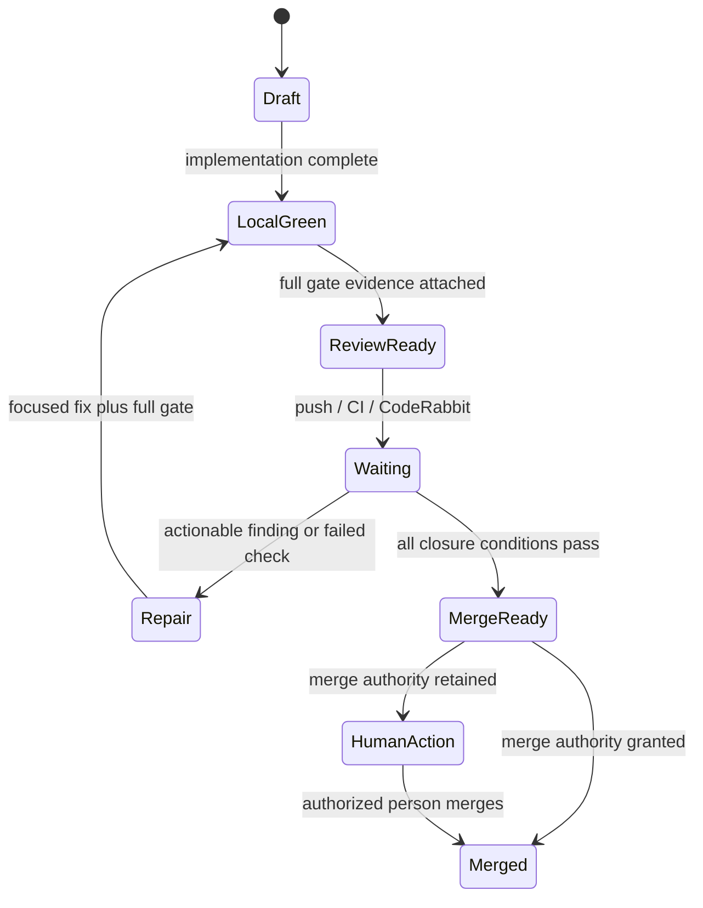

# GitHub and CodeRabbit Loop

## Goal

Produce a pull request whose final revision has deterministic evidence, required repository checks, resolved conversations, and no unresolved actionable production-grade review finding.

CodeRabbit adds an adversarial reviewer. It does not replace project tests, CI, branch protection, human approval, or release authority.

## One-Time Repository Setup

1. Install and authorize the CodeRabbit GitHub app for the repository.
2. Keep the generated root `.coderabbit.yaml`.
3. Protect the default branch or create an equivalent ruleset:
   - require the project's CI status checks;
   - require branches to be current when the repository needs it;
   - require pull-request review;
   - require conversation resolution;
   - prevent ordinary bypass;
   - use a merge queue for a busy repository when integration races justify it.
4. Ensure the agent has least-privilege GitHub access for the actions it is allowed to perform.
5. Keep merge and deployment authority explicit in `.agent-stack/config.json` and repository policy.

GitHub documents these controls in [About protected branches](https://docs.github.com/en/repositories/configuring-branches-and-merges-in-your-repository/managing-protected-branches/about-protected-branches).

## Why This CodeRabbit Configuration

The template:

- uses the `assertive` profile to surface more possible risk;
- enables the request-changes workflow;
- reviews non-draft PRs automatically;
- disables automatic incremental review on every push.

The last choice is intentional. The agent batches coherent fixes, runs the complete local gate, pushes once, and explicitly requests the next incremental review. This reduces review noise and avoids paying for intermediate broken commits.

The current schema and defaults are documented in CodeRabbit's [configuration reference](https://docs.coderabbit.ai/reference/configuration).

## Pull Request State Machine



## Repair Loop

1. Read every current check, review, and unresolved thread.
2. Group only findings with the same root cause and fix.
3. For each finding choose:
   - `fixed`;
   - `rebutted` with code/test/documentation evidence;
   - `deferred` with an authorized issue, risk, and reason current delivery remains safe;
   - `decision-needed` when it crosses an authority boundary.
4. Implement a coherent batch.
5. Run the focused reproduction or test.
6. Run:

   ```bash
   node .agent-stack/bin/agent-stack.mjs check-lock
   node .agent-stack/bin/agent-stack.mjs verify
   ```

7. Commit and push the verified batch.
8. Comment `@coderabbitai review`.
9. Wait for CI and review completion; query threads, not only the summary.
10. Reply with the disposition and evidence. Resolve only after closure.
11. Repeat while the actionable set shrinks.

CodeRabbit documents the available commands, including incremental and full review, pause/resume, resolve, and approve, in [Review commands](https://docs.coderabbit.ai/guides/commands).

## When to Request a Full Review

Use `@coderabbitai full review` when:

- the branch was materially rebased;
- conflict resolution changed behavior;
- a large rewrite invalidated prior coverage;
- generated or renamed files obscured the incremental diff;
- review status is uncertain.

Do not request full review after every small batch.

## Production-Grade Finding Threshold

Always fix or prove false:

- every Critical and Major finding;
- every Minor finding affecting correctness, security, privacy, reliability, data integrity, compatibility, accessibility, observability, deployment safety, or required tests;
- any repeated low-severity finding indicating one systemic defect.

May be rebutted or deferred:

- evidence-proven false positives;
- pure preference or style outside repository standards;
- speculative refactors outside locked scope;
- duplicates closed by the same fix;
- generated, vendored, or intentionally frozen code;
- safe adjacent improvements with an issue and explicit authorization to defer.

"Zero issues" means zero unresolved actionable production risk—not literally zero suggestions.

## Ready-to-Merge Checklist

- [ ] Final revision matches the locked delivery contract.
- [ ] Full local gate passes and evidence path is in the PR.
- [ ] Required GitHub status checks pass.
- [ ] Branch currency or merge-queue rules pass.
- [ ] Required approvals exist.
- [ ] Required conversations are resolved.
- [ ] No actionable CodeRabbit or human finding remains.
- [ ] Every rebuttal and deferral has evidence.
- [ ] Migration, rollback, monitoring, and documentation are current.
- [ ] Merge authority is granted.

If the last box is the only unchecked item, the system is complete from an engineering perspective and returns one human action: merge.

## Non-Convergence

Stop after five repair cycles that fail to reduce the actionable set. Preserve the branch and evidence; report:

- the remaining finding;
- why it persists;
- hypotheses tested;
- changes attempted;
- the exact external dependency or authority decision needed.

Do not loop indefinitely or weaken gates.
