# Skill Stack

## Exact Skills

| Skill | Invocation | Trigger | Output |
|---|---|---|---|
| `setup-autonomous-project` | Explicit | New/existing repository needs autonomous setup or repair | Instructions, templates, detected checks, baseline evidence |
| `run-autonomous-delivery` | End-to-end controller | User wants an end-to-end product/change outcome, including a vague idea or elaborate supplied plan | Verified PR or merge-ready result |
| `develop-project-brief` | With delivery for end-to-end EXTERNAL/DISCOVER; direct for brief-only work | Vague intent or supplied outside material needs discovery, audit, or reconciliation | Reviewable DRAFT ready for approval, approved working brief, or a consequential unresolved decision |
| `coordinate-parallel-delivery` | Routed by delivery | Two or more independent tracks may shorten the critical path | Serial or bounded parallel strategy with primary-agent integration |
| `shape-project` | Implicit or explicit | An approved brief or clear bounded request needs canonical shaping | Lockable delivery contract |
| `use-project-knowledge` | Routed by setup/delivery | Prior knowledge may inform work or verified learning should be preserved | Scoped retrieval receipt or redacted learning proposal |
| `use-project-telemetry` | Explicit or routed by delivery | Configured operational evidence may answer a bounded delivery question | Redacted observation receipt validated against repository evidence |
| `manage-project-work` | Implicit or routed by delivery | Work must be planned, selected, updated, reconciled, or proven complete | Valid normalized work plus bounded evidence relationships |
| `build-vertical-slice` | Explicit phase-specific | The user explicitly limits the request to implementing a locked slice | Demonstrable increment with focused tests/docs |
| `verify-change` | Explicit phase-specific | The user explicitly limits the request to proving an implementation or repair batch | Evidence matrix and binary readiness result |
| `close-review-loop` | Implicit or explicit | PR, CI, human feedback, or configured-provider review needs closure | Closed actionable set and merge decision |
| `maintain-agent-stack` | Explicit | Package flow, source watch, version, or release needs a safe change | Reviewed package update or authority-gated release |
| `secure-launch` | Explicit or routed | A project has public, auth, tenant, data, upload, webhook, paid-API, or launch exposure | Proportionate security gates with deterministic evidence |

The setup, delivery, maintenance, and secure-launch entry points do not hijack
ordinary questions. An end-to-end build request activates
`run-autonomous-delivery` even when the starting idea is vague or arrives as an
elaborate outside plan. On EXTERNAL or DISCOVER routes,
`develop-project-brief` activates with that controller. It activates alone only
when the user explicitly limits the request to brief refinement, source audit,
or reconciliation. The delivery controller owns implementation and
verification quality gates for its end-to-end route; the phase skills remain
available as direct entry points for requests explicitly limited to those
phases and are not mandatory nested native activations.

## Routing

```mermaid
flowchart LR
    SET["setup-autonomous-project"] --> RUN["run-autonomous-delivery"]
    RUN --> KNOW["use-project-knowledge"]
    RUN -->|"configured + bounded operational-evidence need"| TELEMETRY["use-project-telemetry"]
    RUN --> WORK["manage-project-work"]
    WORK --> ROUTE{"Intake router"}
    ROUTE -->|"1. RESUME: unfinished state"| RESUME["Continue first unmet done or evidence condition"]
    ROUTE -->|"2. EXTERNAL: source defines intent"| BRIEF["develop-project-brief"]
    ROUTE -->|"3. DISCOVER: intent needs development"| BRIEF
    ROUTE -->|"4. DIRECT: bounded work"| SHAPE["shape-project"]
    BRIEF -->|"approved BRIEF"| SHAPE
    RESUME --> EXISTING["Existing shaped stage"]
    EXISTING --> SECURE["secure-launch"]
    SHAPE --> SECURE["secure-launch"]
    SECURE --> COORD["coordinate-parallel-delivery"]
    COORD --> EXEC["Controller-owned implementation + verification gates"]
    EXEC -. "explicit phase-specific implementation" .-> BUILD["build-vertical-slice"]
    EXEC -. "explicit phase-specific verification" .-> VERIFY["verify-change"]
    EXEC --> REVIEW["bounded local review audit"]
    REVIEW --> PR["draft pull request"]
    PR --> GATE["protected GitHub review when policy requires it"]
    GATE --> CLOSE["close-review-loop"]
    CLOSE -->|repair| EXEC
    CLOSE -->|green| DONE["merge or merge-ready"]
    DONE --> KNOW
    MAINTAIN["maintain-agent-stack"] --> PACKAGE["reviewed npm update"]
```

The router evaluates modes in the displayed order. `RESUME` preserves valid
non-complete checkpoints, active locks with an unmet done/acceptance/evidence
condition, and closed decisions; completed state and a fully satisfied lock do
not hijack a new request. `EXTERNAL` reads and audits substantial material that
defines proposed product or delivery intent without treating it as
automatically correct. `DISCOVER` develops vague, contradictory, exploratory,
or greenfield product/system intent whose outcome or constraints still need
development. `DIRECT` preserves the compact path for clear bounded work. A
supporting screenshot, log, or attachment does not make bounded work EXTERNAL,
and clear bounded work remains DIRECT in a new or empty repository.

Only `EXTERNAL` and `DISCOVER` create
`.agent-stack/artifacts/BRIEF.md`. It is an optional unlocked working artifact,
not a prerequisite for small work. Once approved, `shape-project` promotes it
into canonical delivery, architecture, security, decision, and verification
artifacts. Downstream shaping, implementation, verification, and review read
closed product decisions before proposing alternatives.

## Why Thirteen

Fewer skills would load large irrelevant procedures into every task. Many more
skills would make discovery unreliable and spread state across shallow modules.
Thirteen gives:

- four stable user entry points;
- one focused owner for flexible intake without splitting brainstorming,
  external import, and reconciliation into separate skills;
- one owner for canonical shaping and each remaining high-risk seam: launch
  security, implementation, knowledge, work evidence, telemetry, delegation,
  verification, and external review;
- one-level references for progressive disclosure;
- no persona catalog, mandatory swarm, or separate orchestration runtime.

`coordinate-parallel-delivery` is a policy coordinator, not a worker persona.
It selects serial, shared-checkout read-only delegation, or isolated parallel
writes from the current harness capability. The primary agent remains
responsible for every worker and the final result. That primary agent is the
Project Steward: it alone retains the checkout coordinator token and writes the
repository checkpoint.

Delivery proceeds through deterministic work and tests, an exact clean commit,
a bounded local reviewer attempt with an inspectable audit result (or durable
unavailable receipt), then a draft PR. Protected GitHub review follows when the
configured policy requires it. The default builtin policy may proceed without
that external requirement, but local audit evidence never authenticates reviewer
independence.

## Installation Locations

Every location below points to the same route-aware workflow contract. The
package does not weaken authority, artifact, verification, or evidence rules
for a particular vendor. Installing an adapter proves discovery wiring, not
that every model/version follows it; compatibility claims require current live
evidence for the exact harness and model.

### Codex

- Plugin package: this directory, containing `.codex-plugin/plugin.json`.
- Repository skills: `.agents/skills/<skill-name>/`.
- Global skills: `~/.agents/skills/<skill-name>/`.

Plugins work in supported desktop/CLI surfaces. Repository skills are the portable option for the Codex IDE extension.

### Claude Code

The default install adds a small `CLAUDE.md` adapter that imports the shared
`AGENTS.md` and requires Claude Code's native delivery controller for
end-to-end work. The controller owns implementation and verification gates;
implementation and verification skills remain available for explicitly
phase-specific requests without mandatory nested activation. It copies the
canonical skills from `.agents/skills/` into `.claude/skills/` and installs
the read-only Claude worker profile, including in a brand-new folder with no
harness markers. A pre-existing `CLAUDE.md` is preserved and proposed for
reconciliation instead of overwritten. Existing `.claude/` markers are also
reported to the agent. Upgrades remember installed harnesses. The legacy
`--claude` flag remains silently accepted for pre-1.0 command compatibility but
does not change the universal adapter install. Customizations are preserved for
reconciliation.

### Grok

Grok discovers `.grok/skills/`, plugins, and user paths, and it also reads `.agents/skills/` plus Claude-compatible locations. The default project setup is therefore sufficient.

### Cursor

Cursor uses the generated root `AGENTS.md`, `.cursor/rules/agent-stack.mdc`, and `.cursor/commands/deliver.md`. Cursor's official rules system is the adapter; do not assume identical skill loading semantics across versions.

### Native Subagents

Codex, Gemini CLI, and OpenCode receive conservative read-only native worker
profiles. Claude Code receives the equivalent profile and skill copies during
the default install. The coordination skill translates one assignment and
authority contract onto those surfaces. It never shells from one vendor into
another. Grok, Cursor, and other harnesses use portable project instructions
and only delegate when the current surface proves a safe native capability;
otherwise they use serial delivery.

## Upgrade Rule

Never overwrite a project's changed skill, instruction, or config blindly. Run
`npx -y ultimate-agent-stack@latest upgrade --concise`; inspect the versioned proposals;
merge substantive changes; record them with `adopt-managed`; re-run `doctor`
and the baseline.

## Optional Tools, Not Dependencies

- `gh` or a connected GitHub app for PR work;
- CodeRabbit or an allowed GitHub human for adversarial PR review;
- GBrain for optional project-scoped cross-conversation knowledge, with
  repository checkpoint fallback;
- an optional reviewed work provider using the same repository work/evidence
  contract;
- Treehouse for reusable isolated worktrees;
- no-mistakes for an additional local push gate;
- AXI wrappers for token-efficient structured tool output;
- Lavish for high-fidelity visual planning artifacts;
- a bounded long-running loop such as GNHF only for a verifiable objective with token, iteration, and stop limits.

The stack remains usable without these optional tools.
