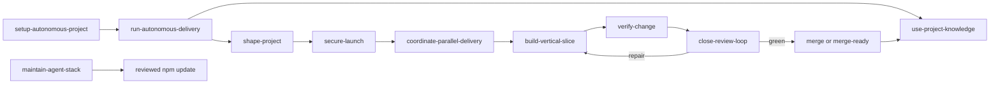

# Skill Stack

## Exact Skills

| Skill | Invocation | Trigger | Output |
|---|---|---|---|
| `setup-autonomous-project` | Explicit | New/existing repository needs autonomous setup or repair | Instructions, templates, detected checks, baseline evidence |
| `run-autonomous-delivery` | Explicit | User wants an end-to-end product/change outcome | Verified PR or merge-ready result |
| `coordinate-parallel-delivery` | Routed by delivery | Two or more independent tracks may shorten the critical path | Serial or bounded parallel strategy with primary-agent integration |
| `shape-project` | Implicit or explicit | Intent, acceptance, architecture, migration, or UX is unclear | Lockable delivery contract |
| `use-project-knowledge` | Routed by setup/delivery | Prior knowledge may inform work or verified learning should be preserved | Scoped retrieval receipt or redacted learning proposal |
| `build-vertical-slice` | Implicit or explicit | A locked slice is ready to implement | Demonstrable increment with focused tests/docs |
| `verify-change` | Implicit or explicit | Implementation or a repair batch needs proof | Evidence matrix and binary readiness result |
| `close-review-loop` | Implicit or explicit | PR, CI, human feedback, or configured-provider review needs closure | Closed actionable set and merge decision |
| `maintain-agent-stack` | Explicit | Package flow, source watch, version, or release needs a safe change | Reviewed package update or authority-gated release |
| `secure-launch` | Explicit or routed | A project has public, auth, tenant, data, upload, webhook, paid-API, or launch exposure | Proportionate security gates with deterministic evidence |

The setup, delivery, maintenance, and secure-launch entry points are explicit
so they do not hijack ordinary questions. The delivery disciplines can trigger
implicitly from precise descriptions.

## Routing

## Why Ten

Fewer skills would load large irrelevant procedures into every task. Many more
skills would make discovery unreliable and spread state across shallow modules.
Ten gives:

- four stable user entry points;
- one owner for each high-risk seam: intent, launch security, implementation,
  knowledge, delegation, verification, and external review;
- one-level references for progressive disclosure;
- no persona catalog, mandatory swarm, or separate orchestration runtime.

`coordinate-parallel-delivery` is a policy coordinator, not a worker persona.
It selects serial, shared-checkout read-only delegation, or isolated parallel
writes from the current harness capability. The primary agent remains
responsible for every worker and the final result.

## Installation Locations

### Codex

- Plugin package: this directory, containing `.codex-plugin/plugin.json`.
- Repository skills: `.agents/skills/<skill-name>/`.
- Global skills: `~/.agents/skills/<skill-name>/`.

Plugins work in supported desktop/CLI surfaces. Repository skills are the portable option for the Codex IDE extension.

### Claude Code

The default install copies the canonical skills from `.agents/skills/` into
`.claude/skills/` and installs the read-only Claude worker profile, including
in a brand-new folder with no harness markers. Existing `.claude/` or
`CLAUDE.md` markers are also reported to the agent. Upgrades remember installed
harnesses, the legacy `--claude` flag remains accepted, and customizations are
preserved for reconciliation.

### Grok

Grok discovers `.grok/skills/`, plugins, and user paths, and it also reads `.agents/skills/` plus Claude-compatible locations. The default project setup is therefore sufficient.

### Cursor

Cursor uses the generated root `AGENTS.md`, `.cursor/rules/agent-stack.mdc`, and `.cursor/commands/deliver.md`. Cursor's official rules system is the adapter; do not assume identical skill loading semantics across versions.

### Native Subagents

Codex, Gemini CLI, and OpenCode receive conservative read-only native worker
profiles. Claude Code receives the equivalent profile and skill copies during
the default install. The coordination skill translates one assignment and
authority contract onto those surfaces. It never shells from one vendor into
another. Grok, Cursor, and other harnesses use portable project instructions
and only delegate when the current surface proves a safe native capability;
otherwise they use serial delivery.

## Upgrade Rule

Never overwrite a project's changed skill, instruction, or config blindly. Run
`npx -y ultimate-agent-stack@latest upgrade`; inspect the versioned proposals;
merge substantive changes; record them with `adopt-managed`; re-run `doctor`
and the baseline.

## Optional Tools, Not Dependencies

- `gh` or a connected GitHub app for PR work;
- CodeRabbit or an allowed GitHub human for adversarial PR review;
- GBrain for scoped cross-session or cross-project knowledge;
- Treehouse for reusable isolated worktrees;
- no-mistakes for an additional local push gate;
- AXI wrappers for token-efficient structured tool output;
- Lavish for high-fidelity visual planning artifacts;
- a bounded long-running loop such as GNHF only for a verifiable objective with token, iteration, and stop limits.

The stack remains usable without these optional tools.
